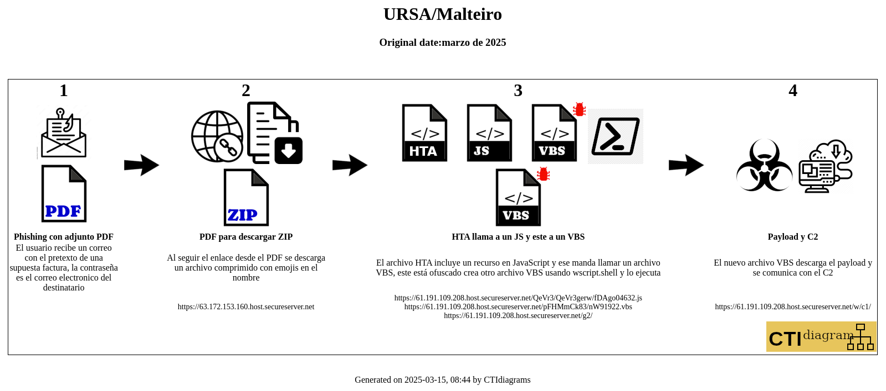

This folder contains the source and results for the attack flow.

The source is **ursa2025.yaml**. It should be processed by [CTIdiagram](http://ctidiagram.com) to generate something like 

The results were obtained with the new version of the tool. If you see the files ursa2025.html and ursa2025iocs.html the icon images from the table are missing, but the screenshots embedded are working OK.

Check the CTIdiagram tool for more info.
