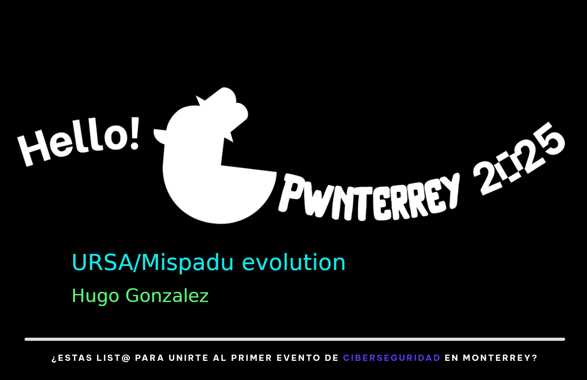

% URSA/Mispadu evolution
% Hugo Gonzalez
% Pwnterrey - May 24, 2025

---



---


---

# Content

::: columns

:::: {.column width=70%}

- Whoami
- Objective
- URSA/Mispadu
- 2023 Campaign
- 2025 Campaign
- Details
- Conclusions                        
- Q \& A

::::

:::: {.column width="30%"}


::::

:::

---

## Whoami

::: columns

:::: {.column width="30%"}


::::

:::: {.column width=70%}

- Use to be an academic full time
- Use to work at SCILabs
- Lecturer in graduated programs (Malware analysis)
- Working in SOC for a fortune 500 in manufacturing with main office in Germany
- CTI and malware analyst in free time

::::

:::

---

## Overview

Give a brief introduction about Mispadu and explain infection chain used by the threat and compare campaings from 2023 and 2025.

---

### URSA/Mispadu

- It is banking trojan designed to steal financial credentials and do remote control on affected systems.
- Focus in LATAM, some campaigns directly to Mexico as a target. Lately some financial institutions from Europe had been added.
- Originally from Brasil (as other banking trojans)
- Malteiro operates this malware as a service

---


---

- Looking for some samples for my malware analysis class I got a sample of this
- Same panel and same obfuscation, so I been tracking for a few months with less resources

---

## 2023 Campaign targeting Mexico

Everything starts with an email!

---


---

## 2025 Campaign targeting Mexico

Main differences

- More steps at the begining
- Geo fenced
- Multiple redirections
- Using https
- Same control panel
- Same obfuscation on the VBS

---


---


[Interactive view](ursa2025.html)

[Interactive view with IoCs](ursa2025iocs.html)

---


---

## Deofuscation

- Deobfuscate the strings to obtain the next payloads url. I'm lazy, so steps ...
  - Manual function identification
  - Manual key identification

---


---


---


---


---

## Hunting for the Panel

- In 2023 while exploring the server distributing the paylod, I came to /w/c?/ that contains information about different campaings.
- Until now, the same urls are working!

---

### First approach

- Use nmap http-title to obtain the distinctive title

    ```nmap -p 80,443 --script http-title --script-args http-title.url=/w/c1/  111.190.202.0/24 ```

- Is not always accurate


---

### Second approach

- Use curl in a loop to test for the webpage, then corroborate with nmap title

  ```for i in $(seq 1 254); do curl -I \
     https://63.172.153.$i.host. secureserver.net/w/c1/; done ```

---

- Improve it for parallel jobs

     ```for i in $(seq 1 254); do echo \
        https://63.172.153.$i.host. secureserver.net/w/c1/; done | parallel -j8 'curl -s -o /dev/null -w "%{http_code} %{url_effective}\n" {}'```


---

## Details

Tools info and slides


https://github.com/hugo-glez/pwnterrey2024

---


## Conclusions

- Threat actor keeps busy!
- Threat keeps evolving but not obfuscation

---

## Comercial break

- [CTIdiagram](https://ctidiagram.com)
  - New interactive version to be released

- Transform yaml -> html (take picture)


---


---

## QA

- @hugo_glez
- hugo.gonzalez@upslp.edu.mx
- linkedin.com/in/hugoxglez

[Questions](https://onlinequestions.org/)